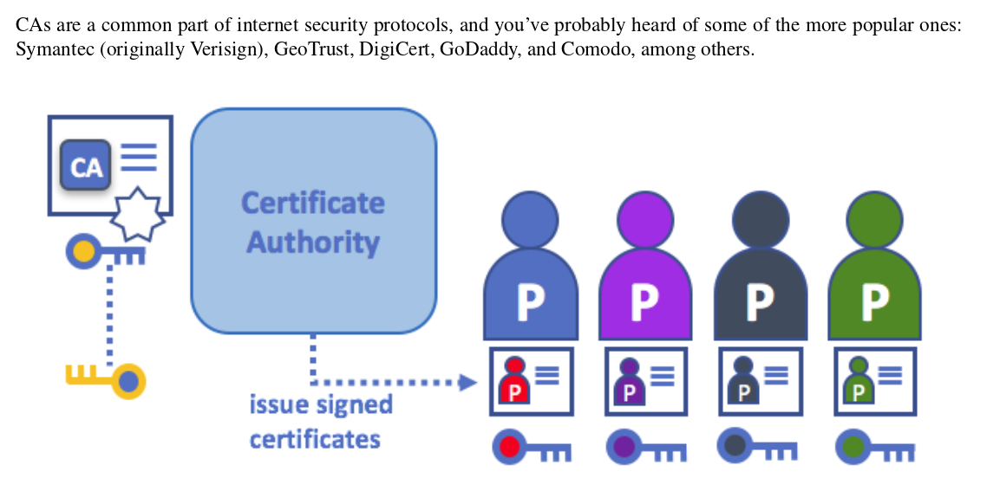
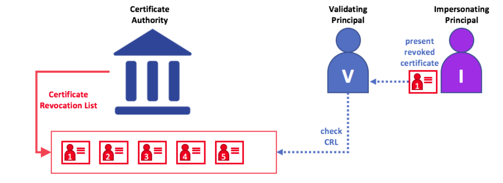

# `Key concepts`

Hyperledger network doesn't need these public consensus mechanisms, instead uses what is called Membership Service Provider(MSP) to bring an agreement and validation to the network.

`Shared ledger`

Hyperledger fabric has a ledger subsystem compromising two components . ie  `the world state` and the `transaction log`.

`Smart contracts`

Regarding chaincode development, GO programming language is the most supported but future Java releases are also expected.

`Privacy`

Hyperledger fabric supports networks where privacy(Using channels) is a key operational requirement as well as the networks are comparatively open.

`Consensus`

Hyperledger fabric allows the use of a consensus depending on the relationship and role of the participants.
The consensus mechanisms that are commonly used are `SOLO`, `Kafka` and will soon extend to `SBFT`(Simplified Fault Tolerance).

## `Hyperledger fabric functionalities`

Hyperledger fabirc is an implementaion of of Distributed Ledger Technology(DLT) that delivers interprise-ready network security, scalability, confidentiality and performance in a modular blockchain architecture. It delivers the following funcitonalities.

`Identity management`

To enable permissioned network, hyperledger fabric enables Membership Identity Service that manages user IDs and authenticated all the participants on the network. It can use Access Control lists to provide additional layers of permission through authorizarion of specific network operations. An example I can give is; a user with ID can be permissioned to invoke a chaincode BUT blocked from deploying a new chaincode.

`Privacy and confidentiality`

Hyperledger fabric enables competing business interests and any groups that require private, confidential transactions to coexist on the same permissioned network through private network channels that ristrict access to specific channels to prevent acess to anauthorised transactions and other information.

`Efficient processing`

Hyperledger fabric provides concurrency and parallelism to the network by assigning network roles by node type where transaction execution is separated from transaction ordering and commitment. This concurrency execution increases processing efficiency on each peer and accelerates delivery of transactions to the ordering service.

`Chaincode functionality`

Chaincode application encode logic that is invoked by specific types of transactions on the channel. System chaincode is distinguished as chaincode that defines operating patameters for the entire channel.

`Modular design`

Hyperledger fabric implements a modular architecture to provide functional choice to network designers. The result is a universal blockchain architecture that any industry or public domain can adopt, with the assurance that its networks will be interoperable across market, requlatory and geographic boundaries.

## `Hyperledger fabric model`

`Assets`

Assets can be tangible(real estate && hardware) or intangible(contracts and intellectual property).
Hyperledger fabric provides the ability to modify assets using chaincode transactions.
They can be represented as/in binary and/or JSON form.
You can easily define and use assets in your hyperledger fabric application using [Hyperledger fabric composer](https://github.com/hyperledger/composer) tool.

`Chaincode`

Chaincode is software defining assets and the transaction instructions for modifying assets. In otherwords, It is a businness logic. Chaincode execution results in a set of key value sets that can be submitted to the network and applied to the ledger on all peers.

`Ledger features`

The ledger is a sequenced, tamper-proof record of all state transitions in the fabric. State transitions are a result of chaincode invocations('transactions') submitted by participating parties. Each transation results in a set of asset key-value pairs that are committed to the ledger as 'creates', 'updates' or 'deletes'.

`Privacy through channels`

To solve the gaps between total transparency and privacy, values within chaincode can be encrypted (in part or in total) using common cryptographic algorithms such as AES before sending transactions to the ordering service and appending blocks to the ledger. Once encrypted data has been written to the ledger, it can only be decrypted by a user in possession of the
corresponding key that was used to generate the cipher text.

`Security and membership services`

Hyperledger fabric underpins a traditional network where all the participants have known identities and the public key infrastructure is used to generate cryptographic certificates that are then tied to the organisations, network components, end users or client applications. This helps address scenarios where privacy and security are paramount concerns. Hyperledger uses the `sign`, `verify` and authenticate approach to implement confidentiality.

`Consensus`

This is not only a process of agreeing to the validity of atransaction. Instead it is a process of that involves a full-circle verification of the correctness of a set of transactions comprising a block.
View the transaction flow for more information.

`Identity`

Hyperledger fabric network contains different actors that include peers, orderers, client applications and more. These actors to be abel to consume services, they should have a digital identity encapsulated in an X.509 digital certificate. These identities are essential because they determine the exact permissions over resources and access to information that actors have in a blockchain network.

A digital identity further has attributes that act as userIDs or groupIDs but are given a special name - `principals`. They are better because they provde  flexibility since they include a wide range of properties of an actor's identity such as actor's organisation, organisation unit, role or even the actor's specific identity. Inotherwords, when we talk about principals; they are the properties that determine their permissions.

Note that for an identity to be verifiable, it must come from a trustable authority. This is how A Membership Service Provider(MSP) is archieved with the adoption of Publick Key Infrastructure(PKI) hierarchical model.

`A simple scenario for the use of identity in Hyperledger fabric`

`What are PKIs`
A Public Key Infrastructure is a collection of internet technologies that provide secure communications in a network. It helps to insure that the information retrieved from the internet is actually coming from the very right source. eg HTTPS protocol

`There are 4 Key elements of PKIs are`

- Digital Certificates
  - This is a document that holds a set of attributes relating to the holder of the digital certificate. The most common one is the X.509 standard certificate that allows the encoding of a party's identifying details in it's structure.
  
- Public and Private keys
  
  - As the name suggests, a public key is always public and can be shared by anyone the fact being also included on the digital certificate unlike the private key. Public key is used to incrypt the data while the private key decrypts them. The unique mathematical relationship that lies between public and private keys is that the private key can be used to produce a signature that only the corresponding public key can match with, and only on the same message.
  

- Certicate Authorities
  
  - A certificate authority dispenses digital certificates to actors. Theses certificates are digitally assigned by the CA nd bing together the actor with the actor's public key. This eventually allows one with the actor's public key to trust the actor, it's identities and the attributes attached to it. Note that it's the CA that provides the basis for an organisation's actors to have a verifiable digital identity in a blockchain network(Hyperledger fabric).
  

  `Root CAs, Intermediate CAs and Chains of Trust`
   Root CAs have to securely distribute hundreds of millions of certificates to internet users. It makes sense to spread this process out across what are called - _Intermediate CAs_. These Intermediate CAs have their own certificates issued byt the root CA or another intermediate authority, allowing the establishment of 'chain of trust' for any certificate that is issued by any CA in the chain. Not the is an intermediate CA  is compromised, on the other hand, there will be a much smaller exposure.
  - 
  _Note that a chain of trust is established between a Root CA and a set of intemediate CAs as long as the issuing CA for the certificate of each of these intermediate CAs is either the Root CA itself or has a chain of trust to the root CA_

  `Fabric CA`

  This is a built-in Root CA provided by fabric to help you build CAs in the blockchain network you form. It is a private CA provider that is capable of managing digital identities of fabric participants that have the form X.509 certificates. Since it customly targets the Root CA needs of fabric, it is inherently not capable of providing SSL certificates general/automatic use in browsers.

- Certificate Revocation List(CRL)
  
  - A Certification Revocation List is a list of references to certificates that a CA knows to be revoked for one reason of another.
  When a third party wants to verify another party's identity, it first checks the issuing CA's CRL to make sure that the certificate has not been revoked. A verifier doesn't have to check the CRL, but if they don't; they run the risk of accepting a compromised identity.
  
  If an impersonate tries to pass a compromised digital certificate to a validating party, it can first be checked against the issuing CA's CRL to make sure it's not listed as no longer valid.
  Please note that a certificate being revoked is totally different from certificate expiring. For more information about CRLs click [here](https://hyperledger-fabric-ca.readthedocs.io/en/latest/users-guide.html#generating-a-crl-certificate-revocation-list)

## `Membership`

How can the identities be used to represent the trusted members on the blockchain network??
Here comes into play the Membership Service Provider(MSP). This identifies which Root CA and intermediate CAs that are trusted to define the members of a trusted domain. eg by listing the identities of the members of by identifying which CAs are authorized to issue valid identities for their members of both.
The power of MSP goes beyond and can also be used to determine he roles of organisation members and also defining the access previleges in the context of network or channels. (eg.., channel admins, readers, writers, etc)
The configuration of channel MSP, it is advertised to all the channels where members of the corresponding organisation participate.

 _Note that in addition to channel MSP, peers, orderers and clients aslo maintain a local MSP to authenticate the member messages outside the context of a channel and to define the permisions over a particular component.(who has the ability to install chaincode on a peer._

`Mapping MSPs to Organisations`

Organisations(orgs) are important in such a way that they manage their members in a single MSP. They have a naming convention of (e.g., org1-MSP). With multiple memberships, it is easy with (e.g., org1-MSP-NATIONAL, org2-MSP-GOVERNMENT).

`Organisational Units(OUs)`

An organisation is often divided into multiple organisational units(OUs), each which has a certain set of responsibilities. Forexample, the ORG1 might have both 'ORG1-MANUFACTURING' and 'ORG1-DISTRIBUTION' OUs to reflect these separate lines of business. Whne a CA issues a X.509 certificate, the OU field in the certificate specifies the line of business to which the identity belongs. OUs can also be helpful when it comes to the controlling of the parts of an organisation who are members of the blockchain network.

`Local and Channel MSPs`
MSPs appear in two places in a blockchain network: channel configuration(channel MSPs) and locally on actor's premise(local MSPs). _Note that the `Local Msps` are defined for clients(users) and for nodes(peers and orderers)_

_**`Every node and user must have a local MSP defined` since it defines who have the participatory rights at that level(peer admins will not necessarily be the channel admins and vice versa)**_

In contrast to local MSPs, `channel MSPs define the administrative and participatory rights at the channel level`. Once there is any mismatch in authentication in the channel, the transactions and other activities are immediately rejected.

The key difference between local and channel MSPs is not hoe they function -- both turn identities into roles -- but their scope

_**Note that `Local MSPs` `are only defined on the file system of the node or user to which they apply`. Therefore, physically and logically there is only one local MSP per node or user. However, as channel MSPs are available to all the nodes in the channel, they are logically defined once in the channel configuration. `However, a channel MSP is also instantiated on the file system of every node in the channel and kept synchronized via consensus`.**_

`MSP Levels`

It is important to keep in mind that the MSPs are at different levels with `MSPs at a higher level relating to network administration concerns` while `MSPs t lower level handle identity for the admistration of private resources`. Note also that MSPs are mandatory at each level of administration - they must be defined for the network, channel, peer, orderers and users. `orderer MSP` is also defined on the file system of the node and onlt applies to that node.

Note that the MSPs for the peer and orderers are kep local whereas the MSPs for the channel(including network configuration) are shared across all the participants of the channel.

_**In this figure, the network configuration
channel is administered by ORG1, but another application channel can be managed by ORG1 and ORG2. The peer
is a member of and managed by ORG2, whereas ORG1 manages the orderer of the figure. ORG1 trusts identities
from RCA1, whereas ORG2 trusts identities from RCA2. Note that these are administration identities, reflecting who
can administer these components. So while ORG1 administers the network, ORG2.MSP does exist in the network.**_

`Network MSP` The configuration of a network defines who are the members in the network — by defining the MSPs of the participant organizations — as well as which of these members are authorized to perform administrative tasks (e.g., creating a channel)

`Channel MSP` It is important for a channel to maintain the MSPs of its members separately. A channel provides
private communications between a particular set of organizations which in turn have administrative control over it

`Peer MSP` This local MSP is defined on the file system of each peer and there is a single MSP instance for each peer. Conceptually, it performs exactly the same function as channel MSPs with the restriction that it only applies to the peer where it is defined

`Orderer MSP` Like a peer MSP, an orderer local MSP is also defined on the file system of the node and only applies to that node. Like peer nodes, orderers are also owned by a single organization and therefore have a single MSP to list the actors or nodes it trusts.

`MSP Structure`

So far, you've seen that the most important element of an MSP is specification of the root or the Intermediate CAs that are used to establish an actor's or node's membership in the respective organisation. There are, however, more elements that are used in conjunction with these two to assist with membership functions.

The figure above shows a local MSP is stored on a local file system. Even though channel MSPs are not physocally structured in that way, it's still a helpful way to think about them.

Let's try to look together what the above folders/divisions really do --:

`Root CAs` --:
This folder contains  list of self-signed X.509 certificates of the root CAs trusted by the organisation represented by this MSP. Note that this is the most important folder because it identifies the CAs from which all other certificates must be derived to be considered members of the corresponding organisation.

`Intermediate CAs` --:
This folder contains a list of X.509 certificates of the Intermediate CAs trusted by this
organization. Each certificate must be signed by one of the Root CAs in the MSP or by an Intermediate CA whose issuing CA chain ultimately leads back to a trusted Root CA.
_**Notice, that it is possible to have a functioning network that does not have an Intermediate CA, in which case
this folder would be empty.**_

`Organisational Units, OUs` --:
These are listed in the `$FABRIC_CFG_PATH/msp/config.yaml` file and contain a list of organisational units, whose members are considered to be part of the organisation represented by this MSP. This can be specified when you want to achieve high level of restriction of the members of an organisation to the ones having an identity with a specific OU in it.

__**Note that specifying OUs is optional and if there is no Ous are listed, all the end identities that are part of  of an MSP -- as identified by the Root CAs and Intermediate folders -- will be considered members of the organisation.**_

`Administrators` --:
This folder contains a list of identities that define the actors who have the role of administrators for this organisation. Note that for a standard MSP type, there should be one or more X.509 certificates this list.

`Revoked Certificates` --:
If the identity of an actor has been revoked, identifying information about the identity -- not the identity itself -- is held in this folder. For X.509-based identities, these identities are pair of strings known as Subject Key Identifier(SKI) or Authority Access Identifier(AKI), and are checked whenever the X.509 certificate is being used to make sure the certificate is not revoked. _This is conceptually the same as a CA's Certificate Revocation List(CRL), but it also related to revocation of membership from organisation_. As a result, the administrator of an MSP, local or channel, can quickly
revoke a actor or node from an organization by advertising the updated CRL of the CA the revoked certificate
as issued by. _This 'list of lists" is optional. It will only be populated when the certificates are revoked._

`Node Identity` --:
This folder contains that identity of the node. ie the cryptographic material that -- in combination of the content of the `keystore` -- would allow the node to autenticate itself in the messages that is sends to other participants of its channels and network.

This folder is mandatory for local MSPs, and there must be exactly one X.509 for the node. It is not used by channel MSPs. _This is the certificate a peer places in a transaction proposal response, forexample to indicate that the peer indorsed it.

`KeyStore for Private keuys` --:
This folder is defined for the local MSP of a peer or orderer node(or in a clients MSP), and contains the node `signing key`. This key matches cryptographically the node's identity inclued in node `identity` folder and is used to sign data -- for example to sign a transaction proposal response, as part of endorsement phase.
_**This folder is mandatory and must contain exactly one private key. Obviously, the acess to folder to this folder must be limited only to the identities of the users who have the administrative responsibility on the peer.**_. Note that the configuration of a channel MSP doesnot include this folder, as channel MSPs solely aim to offer identity validation functionalities and not signing abilities.

`TLS Root CA` --:
This folder contains self-signed X.509 certificates of the Root CAs trusted by this organisation fot **TLS communication**. An example of a TLS communication would be when a peer needs to connect to an orderer so that it can it can receive ledger updates.
_***MSP TLS information relates to the nodes inside the network -- the peers and the orderers, in other words, rather than the application and admistrations that consume the network.*_

There shoulf be atleast one TLS Root CA X.509 certificate in this folder.

`TLS Intermediate CA` --:
This folder contains a list of intermediate CAs trusted by the organisation represented by this MSP for TLS communication. This folder is specifically useful when commercial CAs are used for TLS certificates of an organisation. Similar to membership CAs, specifying intermediate CAs is optional.

## `Peers`

A blockchain network is primarily comprised of a set of peer nodes. Peers are a fundamental element of the network
because they host ledgers and smart contracts. _Smart contracts and ledgers are used to encapsulate the shared processes and shared information
in a network, respectively._

A blockchain network is formed from peer nodes, each of which can hold copies of ledgers and copies of smart contracts.
_In this example, the network N is formed by peers P1, P2 and P3. P1, P2 and P3 each maintain their own
instance of the ledger L1. P1, P2 and P3 use chaincode S1 to access their copy of the ledger L1._
**Note that peers can be created, started, stopped, reconfigured and also deleted. They expose a set of APIs that enable administrators and applications to interact with the services that they provide.**

`Ledgers and chaincode`

More accurately, the peer actually hosts `instances` of the ledger and `instances` of chaincode. This nature of peers provides redundancy in a fabric netwotk - no single point of failure. Not that there can be many ledgers and chaincodes hosted on a single peer.
_Because a peer is a host for ledgers and chaincodes, applications and administrators must interact with a peer if they
want to access these resources. That is why peers are regarded as most fundamental building blocks of a hyperledger fabric network._

`Multiple ledgers`
A peer is able to host more that one ledger, which is important because it allows a flexible system design. The simplest system design is to have a single peer - which is absolutely appropriate to host one or more ledgers if required.

`Applications and Peers`
