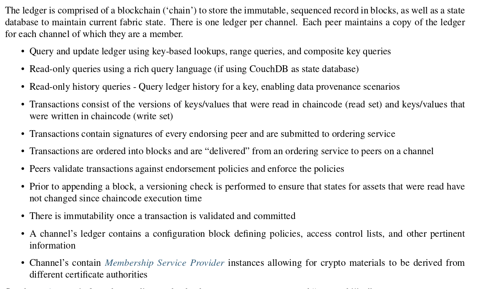

# `Key points`

Hyperledger network doesn't need these public consensus mechanisms, instead uses what is called Membership Service Provider(MSP) to bring an agreement and validation to the network.

`Shared ledger`

Hyperledger fabric has a ledger subsystem compromising two components . ie  `the world state` and the `transaction log`.

`Smart contracts`

Regarding chaincode development, GO programming language is the most supported but future Java releases are also expected.

`Privacy`

Hyperledger fabric supports networks where privacy(Using channels) is a key operational requirement as well as the networks are comparatively open.

`Consensus`

Hyperledger fabric allows the use of a consensus depending on the relationship and role of the participants.
The consensus mechanisms that are commonly used are `SOLO`, `Kafka` and will soon extend to `SBFT`(Simplified Fault Tolerance).

## `Hyperledger fabric functionalities`

Hyperledger fabirc is an implementaion of of Distributed Ledger Technology(DLT) that delivers interprise-ready network security, scalability, confidentiality and performance in a modular blockchain architecture. It delivers the following funcitonalities.

`Identity management`

To enable permissioned network, hyperledger fabric enables Membership Identity Service that manages user IDs and authenticated all the participants on the network. It can use Access Control lists to provide additional layers of permission through authorizarion of specific network operations. An example I can give is; a user with ID can be permissioned to invoke a chaincode BUT blocked from deploying a new chaincode.

`Privacy and confidentiality`

Hyperledger fabric enables competing business interests and any groups that require private, confidential transactions to coexist on the same permissioned network through private network channels that ristrict access to specific channels to prevent acess to anauthorised transactions and other information.

`Effiecient processing`

Hyperledger fabric provides concurrency and parallelism to the network by assigning network roles by node type where transaction execution is separated from transaction ordering and commitment. This concurrency execution increases processing efficiency on each peer and accelerates delivery of transactions to the ordering service.

`Chaincode functionality`

Chaincode application encode logic that is invoked by specific types of transactions on the channel. System chaincode is distinguished as chaincode that defines operating patameters for the entire channel.

`Modular design`

Hyperledger fabric implements a modular architecture to provide functional choice to network designers. The result is a universal blockchain architecture that any industry or public domain can adopt, with the assurance that its networks will be interoperable across market, requlatory and geographic boundaries.

## `Hyperledger fabric model`

`Assets`

Assets can be tangible(real estate && hardware) or intangible(contracts and intellectual property).
Hyperledger fabric provides the ability to modify assets using chaincode transactions.
They can be represented as/in binary and/or JSON form.
You can easily define and use assets in your hyperledger fabric application using [Hyperledger fabric composer](https://github.com/hyperledger/composer) tool.

`Chaincode`

Chaincode is software defining assets and the transaction instructions for modifying assets. In otherwords, It is a businness logic. Chaincode execution results in a set of key value sets that can be submitted to the network and applied to the ledger on all peers.

`Ledger features`

The ledger is a sequenced, tamper-proof record of all state transitions in the fabric. State transitions are a result of chaincode invocations('transactions') submitted by participating parties. Each transation results in a set of asset key-value pairs that are committed to the ledger as 'creates', 'updates' or 'deletes'.

`Privacy through channels`
To solve the gaps between total transparency and privacy, values within chaincode can be encrypted (in part or in total) using common cryptographic algorithms such as AES before sending transactions to the ordering service and appending blocks to the ledger. Once encrypted data has been written to the ledger, it can only be decrypted by a user in possession of the
corresponding key that was used to generate the cipher text.
