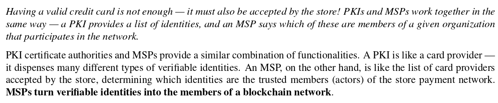
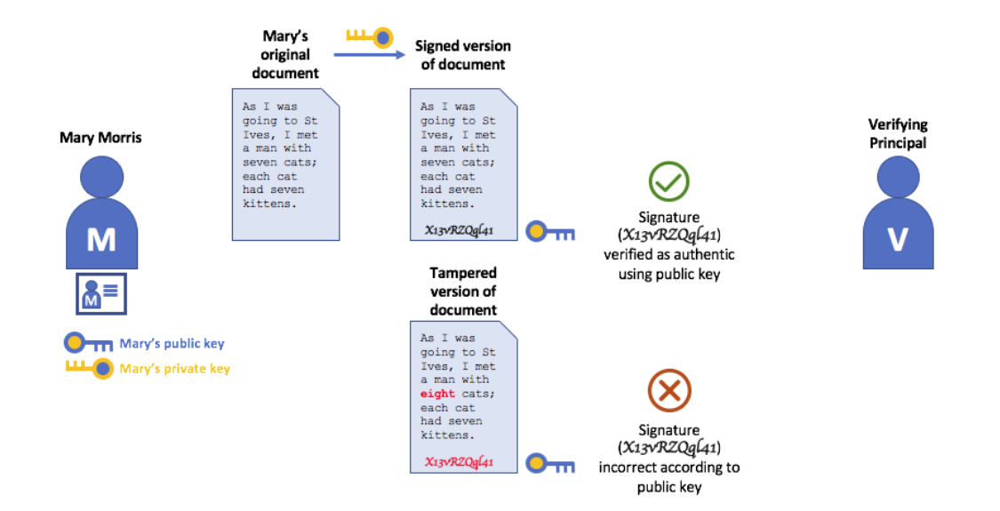

# `Key points`

Hyperledger network doesn't need these public consensus mechanisms, instead uses what is called Membership Service Provider(MSP) to bring an agreement and validation to the network.

`Shared ledger`

Hyperledger fabric has a ledger subsystem compromising two components . ie  `the world state` and the `transaction log`.

`Smart contracts`

Regarding chaincode development, GO programming language is the most supported but future Java releases are also expected.

`Privacy`

Hyperledger fabric supports networks where privacy(Using channels) is a key operational requirement as well as the networks are comparatively open.

`Consensus`

Hyperledger fabric allows the use of a consensus depending on the relationship and role of the participants.
The consensus mechanisms that are commonly used are `SOLO`, `Kafka` and will soon extend to `SBFT`(Simplified Fault Tolerance).

## `Hyperledger fabric functionalities`

Hyperledger fabirc is an implementaion of of Distributed Ledger Technology(DLT) that delivers interprise-ready network security, scalability, confidentiality and performance in a modular blockchain architecture. It delivers the following funcitonalities.

`Identity management`

To enable permissioned network, hyperledger fabric enables Membership Identity Service that manages user IDs and authenticated all the participants on the network. It can use Access Control lists to provide additional layers of permission through authorizarion of specific network operations. An example I can give is; a user with ID can be permissioned to invoke a chaincode BUT blocked from deploying a new chaincode.

`Privacy and confidentiality`

Hyperledger fabric enables competing business interests and any groups that require private, confidential transactions to coexist on the same permissioned network through private network channels that ristrict access to specific channels to prevent acess to anauthorised transactions and other information.

`Effiecient processing`

Hyperledger fabric provides concurrency and parallelism to the network by assigning network roles by node type where transaction execution is separated from transaction ordering and commitment. This concurrency execution increases processing efficiency on each peer and accelerates delivery of transactions to the ordering service.

`Chaincode functionality`

Chaincode application encode logic that is invoked by specific types of transactions on the channel. System chaincode is distinguished as chaincode that defines operating patameters for the entire channel.

`Modular design`

Hyperledger fabric implements a modular architecture to provide functional choice to network designers. The result is a universal blockchain architecture that any industry or public domain can adopt, with the assurance that its networks will be interoperable across market, requlatory and geographic boundaries.

## `Hyperledger fabric model`

`Assets`

Assets can be tangible(real estate && hardware) or intangible(contracts and intellectual property).
Hyperledger fabric provides the ability to modify assets using chaincode transactions.
They can be represented as/in binary and/or JSON form.
You can easily define and use assets in your hyperledger fabric application using [Hyperledger fabric composer](https://github.com/hyperledger/composer) tool.

`Chaincode`

Chaincode is software defining assets and the transaction instructions for modifying assets. In otherwords, It is a businness logic. Chaincode execution results in a set of key value sets that can be submitted to the network and applied to the ledger on all peers.

`Ledger features`

The ledger is a sequenced, tamper-proof record of all state transitions in the fabric. State transitions are a result of chaincode invocations('transactions') submitted by participating parties. Each transation results in a set of asset key-value pairs that are committed to the ledger as 'creates', 'updates' or 'deletes'.

`Privacy through channels`

To solve the gaps between total transparency and privacy, values within chaincode can be encrypted (in part or in total) using common cryptographic algorithms such as AES before sending transactions to the ordering service and appending blocks to the ledger. Once encrypted data has been written to the ledger, it can only be decrypted by a user in possession of the
corresponding key that was used to generate the cipher text.

`Security and membership services`

Hyperledger fabric underpins a traditional network where all the participants have known identities and the public key infrastructure is used to generate cryptographic certificates that are then tied to the organisations, network components, end users or client applications. This helps address scenarios where privacy and security are paramount concerns. Hyperledger uses the `sign`, `verify` and authenticate approach to implement confidentiality.

`Consensus`

This is not only a process of agreeing to the validity of atransaction. Instead it is a process of that involves a full-circle verification of the correctness of a set of transactions comprising a block.
View the transaction flow for more information.

`Identity`

Hyperledger fabric network contains different actors that include peers, orderers, client applications and more. These actors to be abel to consume services, they should have a digital identity encapsulated in an X.509 digital certificate. These identities are essential because they determine the exact permissions over resources and access to information that actors have in a blockchain network.

A digital identity further has attributes that act as userIDs or groupIDs but are given a special name - `principals`. They are better because they provde  flexibility since they include a wide range of properties of an actor's identity such as actor's organisation, organisation unit, role or even the actor's specific identity. Inotherwords, when we talk about principals; they are the properties that determine their permissions.

Note that for an identity to be verifiable, it must come from a trustable authority. This is how A Membership Service Provider(MSP) is archieved with the adoption of Publick Key Infrastructure(PKI) hierarchical model.

`A simple scenario for the use of identity in Hyperledger fabric`

`What are PKIs`
A Public Key Infrastructure is a collection of internet technologies that provide secure communications in a network. It helps to insure that the information retrieved from the internet is actually coming from the very right source. eg HTTPS protocol

`There are 4 Key elements of PKIs are`

- Digital Certificates
  - This is a document that holds a set of attributes relating to the holder of the digital certificate. The most common one is the X.509 standard certificate that allows the encoding of a party's identifying details in it's structure.
  
- Public and Private keys
  
  - As the name suggests, a public key is always public and can be shared by anyone the fact being also included on the digital certificate unlike the private key. Public key is used to incrypt the data while the private key decrypts them. The unique mathematical relationship that lies between public and private keys is that the private key can be used to produce a signature that only the corresponding public key can match with, and only on the same message.
  

- Certicate Authorities
  
  - A certificate authority dispenses digital certificates to actors. Theses certificates are digitally assigned by the CA nd bing together the actor with the actor's public key. This eventually allows one with the actor's public key to trust the actor, it's identities and the attributes attached to it. Note that it's the CA that provides the basis for an organisation's actors to have a verifiable digital identity in a blockchain network(Hyperledger fabric).
  

  `Root CAs, Intermediate CAs and Chains of Trust`
  Root CAs have to securely distribute hundreds of millions of certificates to internet users. It makes sense to spread this process out across what are called - _Intermediate CAs_. These Intermediate CAs have their own certificates issued byt the root CA or another intermediate authority, allowing the establishment of 'chain of trust' for any certificate that is issued by any CA in the chain. Not the is an intermediate CA  is compromised, on the other hand, there will be a much smaller exposure.
  
  _Note that a chain of trust is established between a Root CA and a set of intemediate CAs as long as the issuing CA for the certificate of each of these intermediate CAs is either the Root CA itself or has a chain of trust to the root CA_

- Certificate Revocation List
